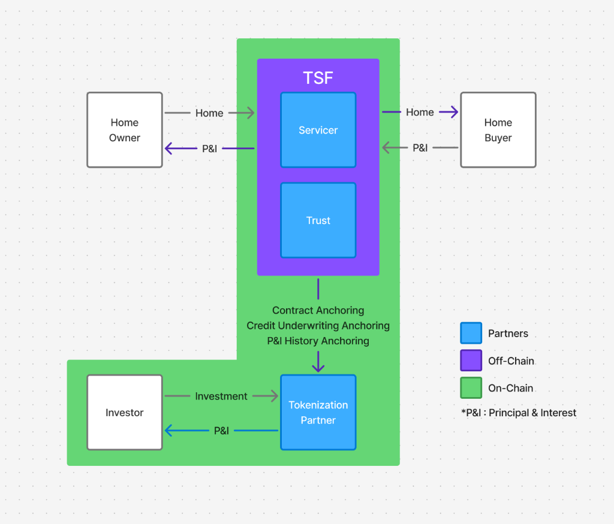

# TSF (Tokenized Seller Financing)

## Overview

**TSF solves the liquidity problem of homeowner seller-financing notes through standardization and tokenization.**

## One-Pager Pitch

### Problem

Seller-financing notes are inherently illiquid.

When homeowners seek early exit, they face several structural challenges:

* Each seller-financing deal is bespoke, making valuation and comparison difficult
* Credit underwriting is inconsistent and fragmented across seller-financing deals
* The accuracy and integrity of the underlying documents and credit record arrangements are uncertain
* Secondary market access is limited to a small set of specialized professional funds

As a result, homeowners are often forced to accept steep discounts or are unable to liquidate their notes at all.

### Solution

TSF standardizes seller-financing deals and enables tokenization of mortgage notes to unlock liquidity without disrupting existing real-world workflows.

#### Standardized Deal Structure

* Homeowners receive guidance on risk and return preferences to set down payment and interest rate
* Buyers are guided based on their credit evaluation and down payment capacity
* Both homeowners and buyers are categorized into standardized risk tiers (Tier A, Tier B, Tier C) to enable consistent structuring and matching

This creates comparable and investable seller-financing notes.

#### End-to-End Marketplace

TSF provides an integrated marketplace covering:

* Homeowner onboarding and deal origination
* Buyer onboarding (credit underwriting & target terms)
* Visit arrangement & property inspection
* Contract generation
* Off-chain payments via licensed loan servicer
* Title and trust management via licensed partners
* On-chain anchoring for verification and auditability

All operational processes remain off-chain and follow existing industry standards.

#### Liquidity via Tokenization

When a homeowner requests liquidity:

1. TSF proposes a fair market price for the seller-financing note
2. Upon homeowner approval, the note is listed on an investor-only marketplace
3. Investors onboard through licensed partners with full AML/KYC
4. Investors select notes and invest
5. Monthly principal and interest payments are distributed pro-rata via smart contracts
6. Investors can claim returns directly on-chain

### Architecture

TSF acts as an orchestration layer between traditional real estate workflows and blockchain-based verification.

* Credit underwriting, contract generation, loan servicing, title management, and payments remain fully off-chain
* On-chain, TSF anchors cryptographic hashes of:
  * Seller-financing contracts
  * Credit underwriting results
  * Payment history

This design provides immutable proof without exposing sensitive data and enables auditability and secondary liquidity.

### Business Model

TSF generates revenue through transparent, transaction-aligned fees across the lifecycle of a seller-financing note.

1. **Origination Fee**
   * 1% of the principal amount (home price minus down payment)
   * Charged to the homeowner at contract generation

2. **Servicing Fee**
   * 1% of monthly principal and interest payments
   * Charged to homeowners or investors

3. **Tokenization & Success Fee (Liquidity Event)**
   * 1.5% charged to the homeowner upon successful funding
     * Tokenization fee: 0.5%
     * Success fee: 1.0%
   * Applied only if 100% of the investment target is reached

### Roadmap

1. **MVP Completion**
   * Finalize functional prototype
   * Firebase integration and edge-case coverage

2. **Legal & Administrative Validation**
   * Review and standardize seller-financing documentation
   * Establish compliant legal and administrative frameworks

3. **Tokenization Partnerships**
   * Integrate AML/KYC providers
   * Establish SPV structures
   * Connect tokenization infrastructure

4. **Servicer & Trust Partnerships**
   * Partner with licensed loan servicers
   * Partner with licensed trust and title management providers

5. **Market Launch (U.S. Focus)**
   * Engage homeowners listing properties on platforms such as Zillow and convert listings into liquidity-friendly seller-financing deals
   * Use standardized seller-financing structures and secured listings to partner with real estate agents and broker networks for buyer acquisition
   * Onboard certified investors through specialized Web3 marketing partners

---

## Hackathon Deliverables

Please find the detailed documentation below:

* [🚀 **Deployment Instructions**](docs/DEPLOYMENT.md) - How to run the project locally and contract details.
* [👥 **Team**](docs/TEAM.md) - Bios and contact info.
* [⚖️ **Compliance Declaration**](docs/COMPLIANCE.md) - Regulatory approach and disclosures.
* [🎥 **Demo**](docs/DEMO.md) - Video and live demo link.
